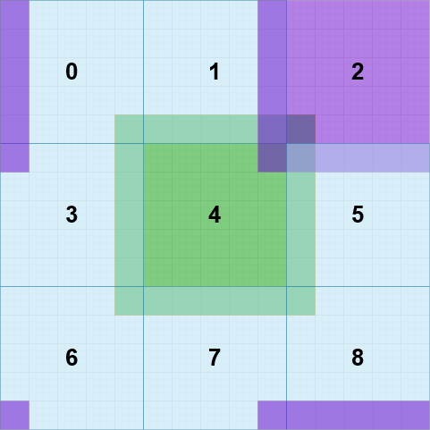
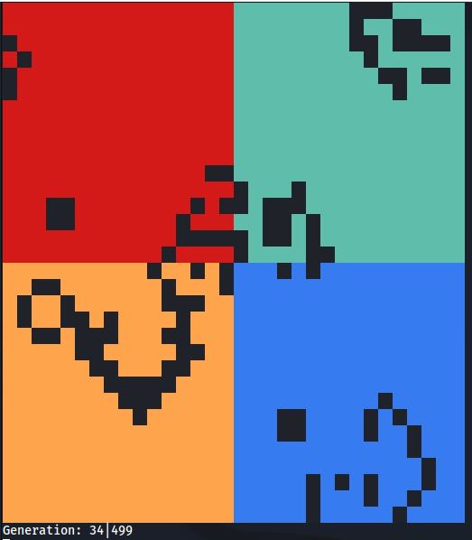

# Game of Life - using MPI

A distributed-computing version of the classic "Game of Life" using the Message Passing Interface (MPI) on Linux. The code includes a stub for leveraging a Pi Cluster to draw the game on 8x8 Led Pi HATs.

The code is commented and includes additional information on how to use, compile and modify the program. The program features no command line parameters but can be configured to some extent via the `#define`s in the beginning.

## Why?

The concept of distributing tasks on multiple processors to maximize throughput is here simulated using [John Conway's Game of Life](https://playgameoflife.com/info) to practice the use of the MPI library in C. The serial version of this cellular automaton is trivial so the challenge arises from distributing the grid on the processors and to let them communicate their border states with the respective neighbours. Below is a depiction of the communications that are necessary between the processors. Each square stands for a single process and its local grid. Together they form the playing field. Since each process needs to know all eight neighbour cells to compute the next state of a single cell, each process has to communicate its borders with the others. For example, processor 2 needs information from 0,1,3,4,5,6,7 and 8.



## Usage

The program distributes the computation of different regions in the Game of Life on the specified amount of processors.

In order to compile and run the code, you'll need the `mpi-default-dev` package (standard in debian repositories).
```bash
sudo apt install mpi-default-dev
```
**Compile the source code:**
```bash
mpicc -o gol-mpi -Wall -lm gol-mpi.c
```
**Execute:**
> Note that in order to execute the following command you will require at least 4 available cores (can be checked with `lscpu`).
```bash
mpirun -np 4 ./gol-mpi  # -np specifies the amount of processors to use
```

## Examples

Running GoL on a 27x27 grid with 9 processors using a glider as start formation and coloring each processors region differently:


Running GoL on a 32x32 grid with 4 processors using a random start formation (35th iteration):


